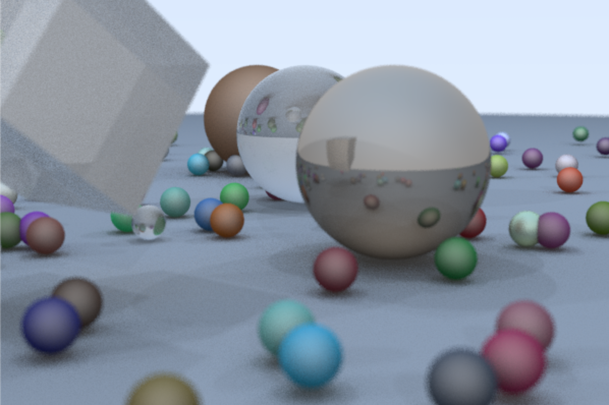

# raytracer
Implemented a basic raytracer without libraries and framework with vanila C++.

  

#### Some of the features below are attributed this <a alt="reference link" href="https://github.com/RayTracing/raytracing.github.io">book</a>
* Sphere
* Materials
  - Metal
  - Dielectric
  - Lambertian (matte)
* Refraction
* Reflection
* Depth of field

#### I implemented the following features:
* Box, Triangle, Rectangle
* Soft shadow
* Light sources 
  - point light
  - parallel light
* Gloss (blinn coloring)

